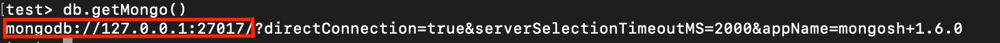
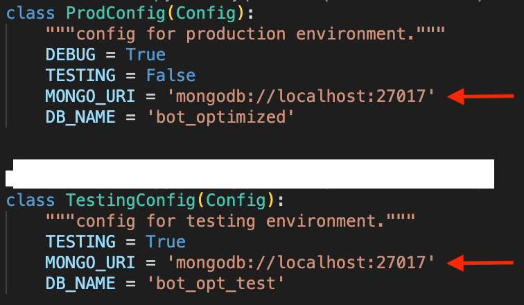

# Installing MongoDB

## Windows and Linux: 

Download MongoDB from [official website.](https://www.mongodb.com/try/download/community)

## For MacOS:

Use Brew to download MongoDB:

**Please make sure that you have HomeBrew installed on your MacOS**

Query commands below on terminal:

````
brew tap mongodb/brew
````

````
brew install mongodb-community@5.0
````

MongoDB is installed on your computer.

Check the version:

````
mongod --version
````

Start the server:
````
brew services start mongodb-community@5.0
````
Log into admin panel
````
mongosh
````

Query this command to see your running port:

`````
db.getMongo()
`````
By default, it is: 27017



Copy your port info and paste it to MONGO_URI varible under ```` src/config.py ````



ProdConfig class is for production environment and TestingConfig is for testing environment.

Your database configurations are ready!