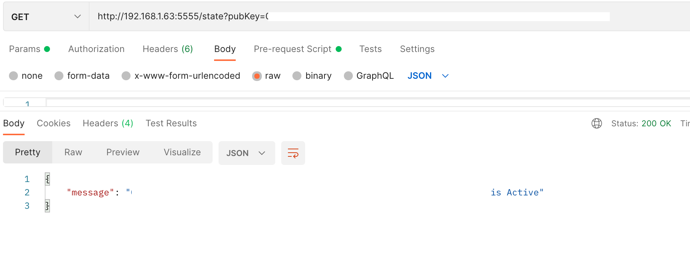

# Bot-Optimized-Validator-Api

Application backend for Casper-Bot-Optimized-Validator-API. Capser Bot Optimized API provides information about active validators working on Casper Network. Project is being developed with Python by usind Flask framework,and under Apache 2.0 License.

## Documentation

Auto generated API documentation can be found and API endpoints can be tested [here](http://38.242.242.73:5555/swagger-ui/#/).

## Get Started

### Prerequisites

Download and run the mongo db server from official [website](https://www.mongodb.com/docs/manual/administration/install-community/).

Also, in the [Install DB File](https://github.com/furkanahmetk/Casper-Bot-Optimized-API/blob/main/docs/INSTALL%20DB.md) it is explained how to install and configure DB on MacOS.

### How to set-up

Clone the repository.
```
git clone https://github.com/furkanahmetk/Casper-Bot-Optimized-API.git
```

Configure src.config file according to mongo db port. Config file's default configuration is as below:
```
DEBUG = True
TESTING = False
MONGO_URI = 'mongodb://localhost:27017'
DB_NAME = 'bot_optimized'
```

To build and run the project
```
make run
```

To run tests
```
make test
```

## Example Usage:

### From Terminal Using Curl:

````
curl -X GET "http://38.242.242.73:5555/delegationRate?pubKey=<publickeytoquerry>" -H "accept: application/json"
````

## Using Auto Generated API endpoint:



**Do not forget to add your pubKey value at the end of query string**
