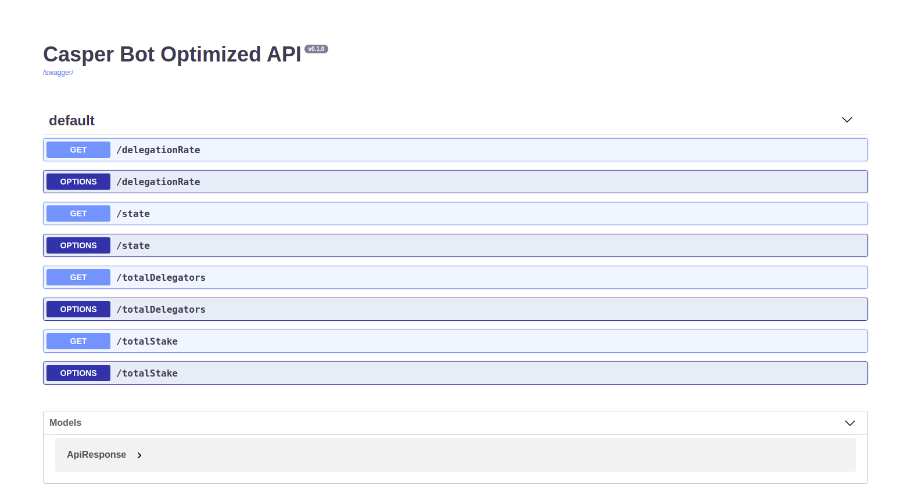
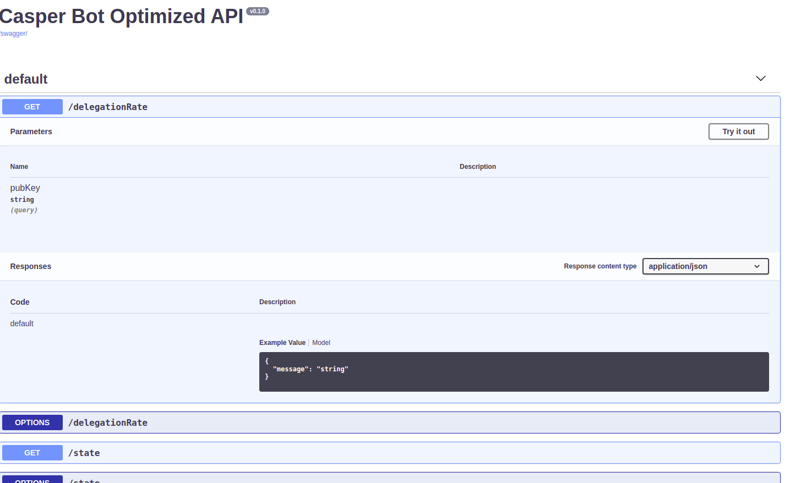
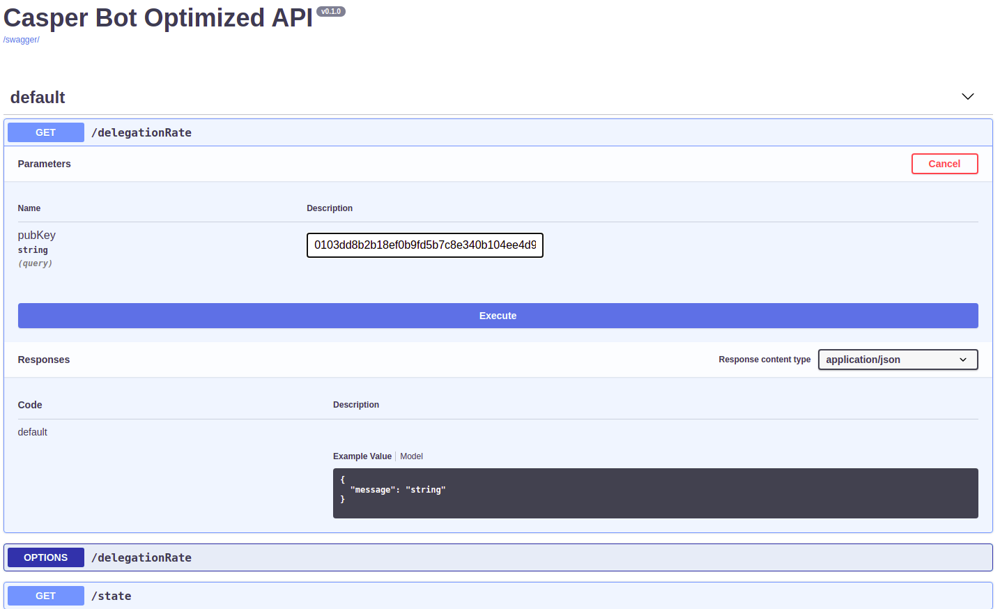

# Bot-Optimized-Validator-Api

Application backend for Casper-Bot-Optimized-Validator-API. Capser Bot Optimized API provides information about active validators working on Casper Network. Project is being developed with Python by usind Flask framework,and under Apache 2.0 License.

## Documentation

Auto generated API documentation can be found and API endpoints can be tested [here](http://38.242.242.73:5555/swagger-ui/#/).
API end point for the documentation will be ip-of-the-server:port//swagger-ui/#/.

## Get Started

### Prerequisites

Python3, pip and make packages should be installed on your system.

#### Install MongoDB

Download and run the mongo db server from official [website](https://www.mongodb.com/docs/manual/administration/install-community/).

Also, in the [Install DB File](https://github.com/furkanahmetk/Casper-Bot-Optimized-API/blob/main/docs/INSTALL%20DB.md) it is explained how to install and configure DB on MacOS as an example.

### How to set-up

Clone the repository.
```
git clone https://github.com/furkanahmetk/Casper-Bot-Optimized-API.git
```

Configure src.config file according to mongo db port. Config file's default configuration is as below:
```
DEBUG = True
TESTING = False
MONGO_URI = 'mongodb://localhost:27017'
DB_NAME = 'bot_optimized'
```

To build and run the project
```
cd /path-to-your-clonned-repository
make run
```

To run tests
```
cd /path-to-your-clonned-repository
make test
```

## Example Usage:

### From Terminal Using Curl:

````
curl -X GET "http://<api-server-ip>:<port>/delegationRate?pubKey=<publickeytoquerry>" -H "accept: application/json"
````
````
curl -X GET "http://<api-server-ip>:<port>/state?pubKey=<publickeytoquerry>" -H "accept: application/json"
````
````
curl -X GET "http://<api-server-ip>:<port>/totalDelegators?pubKey=<publickeytoquerry>" -H "accept: application/json"
````
````
curl -X GET "http://<api-server-ip>:<port>/totalStake?pubKey=<publickeytoquerry>" -H "accept: application/json"
````

## Using Auto Generated [API endpoint](http://38.242.242.73:5555/swagger-ui/#/) :
Click on the method that you want to test.


Click on try it out button.


Enter the public key that you want to querry and click execute button.


And finally following result will be displayed.


**Do not forget to add your pubKey value at the end of query string**
